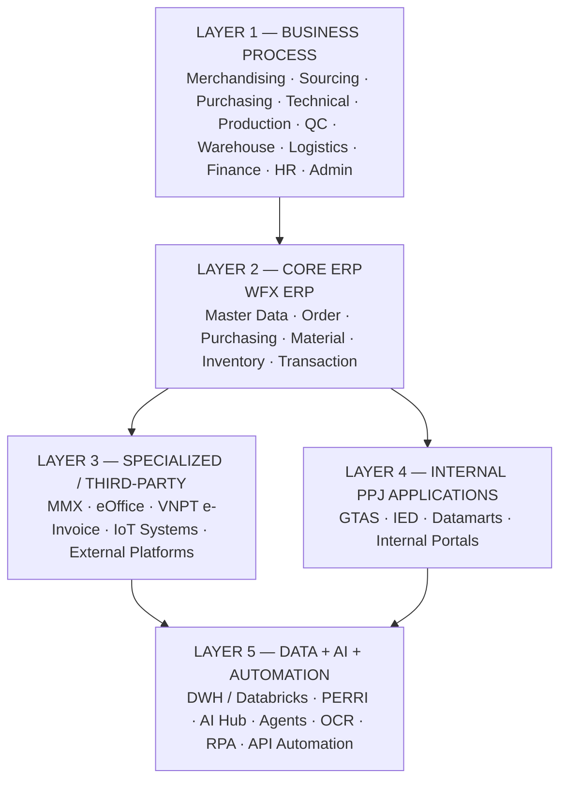
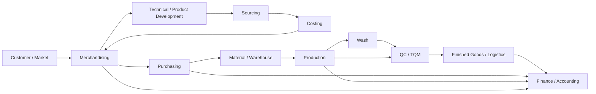
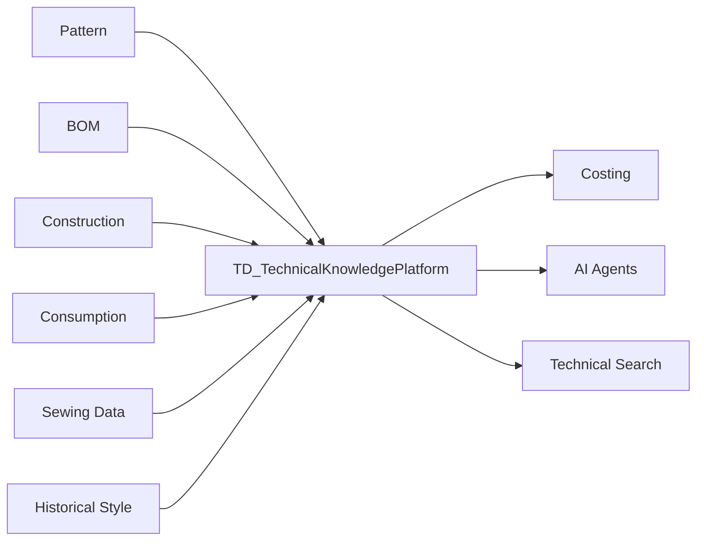
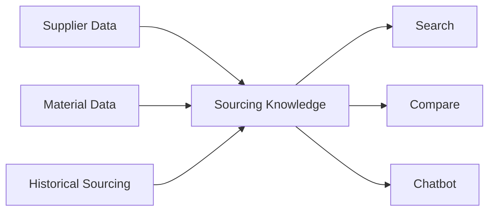
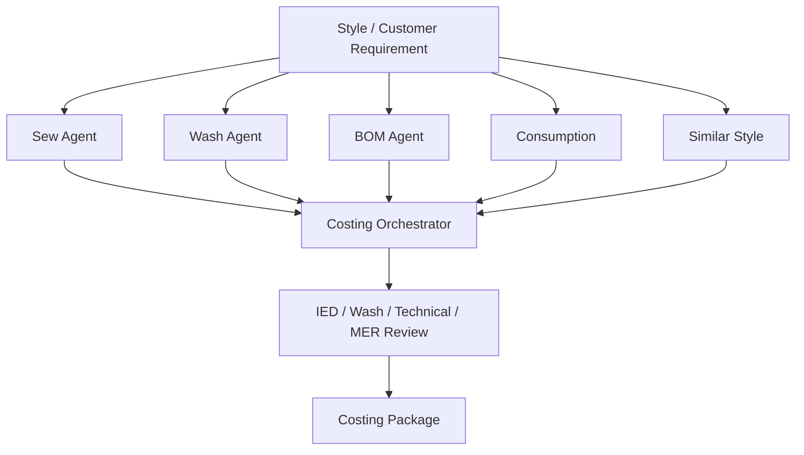
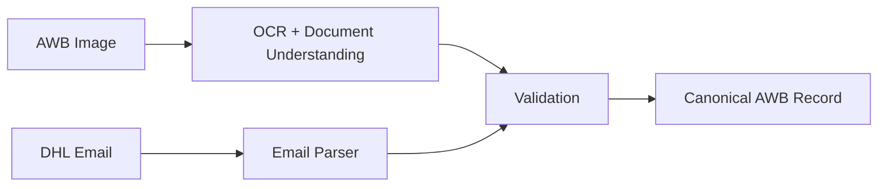
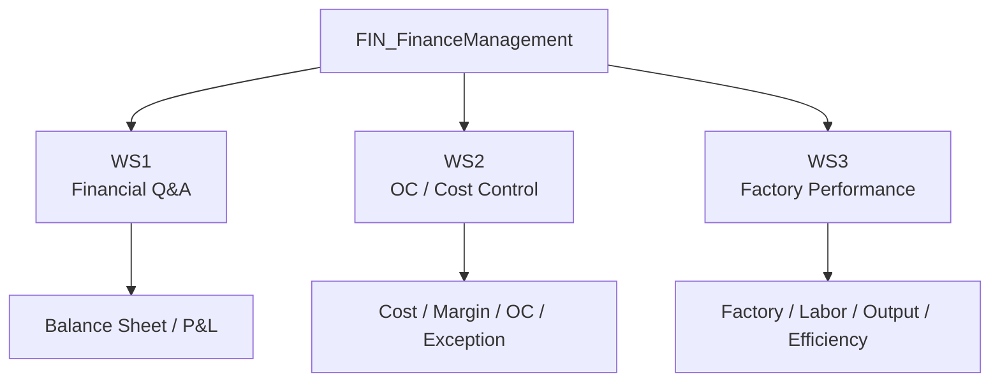
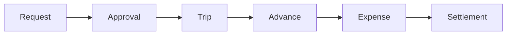
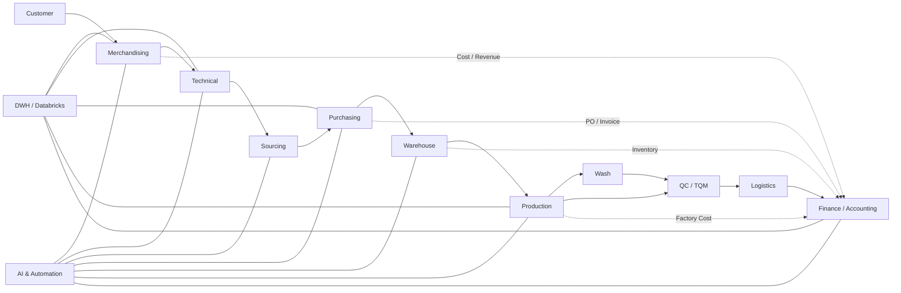

# PPJ Enterprise Application + AI & Automation Ecosystem

**Phạm vi:** toàn bộ luồng nghiệp vụ chính liên quan tới WFX ERP, third-party software, GTAS/Internal Apps, Data Platform và AI/Automation portfolio hiện tại.

> **Assumption:** “hệ thống của chúng ta” ở đây là toàn bộ digital ecosystem PPJ đang xây quanh **WFX + hệ thống bên thứ ba + GTAS + Data/DWH + AI & Automation**, không chỉ riêng các project AI.

## 1. Bức tranh tổng thể

Có thể nhìn toàn bộ hệ thống thành 5 lớp:



Điểm quan trọng:

**AI không thay thế WFX hoặc GTAS.**

AI/Automation chủ yếu nằm ở lớp:

```text
Read
→ Understand
→ Validate
→ Recommend
→ Automate
→ Human Confirm
→ Write back / Execute
```

---

# 2. Business flow end-to-end của PPJ

Luồng tổng thể hiện tại có thể biểu diễn:



Ngoài flow chính còn có các function hỗ trợ xuyên suốt:

```text
HR
Administration
IT / Infrastructure
Data / DWH
AI & Automation
R&D / Smart Operation
External Collaboration
```

---

# 3. Giai đoạn 1 — Market / Customer / Merchandising

## Phòng ban chính

**Merchandising**

Có vai trò gần như “business coordinator” của một đơn hàng.

### Công đoạn

```text
Customer Requirement
→ Style / Product Information
→ Commercial Requirement
→ Preliminary Costing
→ Quotation
→ PO / Order
→ Order Follow-up
```

### Dữ liệu liên quan

* Customer
* Season
* Style
* PO
* Quantity
* Commercial requirement
* Delivery
* Cost
* Margin
* BOM / Material information

### Hệ thống

* WFX
* GTAS
* internal commercial/costing tools
* DWH
* Excel vẫn còn tồn tại ở một số quy trình

### AI / Automation liên quan

#### `MER_CostingAgenticPlatform_v1.1.0`

Hỗ trợ Merchandising và technical teams tạo costing có kiểm soát.

```text
Customer / Product Requirement
→ Technical Understanding
→ Sew / Wash / BOM / Consumption
→ Historical Comparison
→ Cost Recommendation
→ MER Review
```

#### `MER_InvoiceDataRecheck_v1.1.0`

```text
Costing
+
Commercial Cost
+
Invoice Data
→ Cross-check
→ Exception Detection
→ MER Review
```

#### `MER_MarketIntelligence_v1.1.0`

```text
Customer
Market
Competitor
Trend
→ Intelligence
→ Merchandising Decision Support
```

---

# 4. Giai đoạn 2 — Technical Development / Product Engineering

## Phòng ban

* Technical Development
* Pattern / Technical teams
* IED
* Fabric / Textile technical teams
* CPD / Product Development

### Công đoạn

```text
Style
→ Technical Requirement
→ Pattern
→ Construction
→ BOM
→ Consumption
→ Sewing Operations
→ SAM
→ Technical Approval
```

Đây là một trong những source quan trọng nhất cho Costing và Production.

---

## `TD_TechnicalKnowledgePlatform_v2.1.0`

Platform này đóng vai trò tập hợp technical knowledge.



Mục tiêu không phải chỉ lưu file mà phải trở thành:

> **operational technical knowledge base**

---

# 5. Fabric / Material Technical Data

## Phòng ban

* Fabric
* Textile Technical
* Product Development
* Sourcing

## `FAB_FabricDatamart_v2.2.0`

Tập trung vào:

```text
Fabric
Hanger
QR
Fabric reference
Material technical information
```

Dữ liệu có thể được dùng bởi:

* Sourcing
* Costing
* Technical
* Merchandising
* AI search

---

# 6. CPD / Visual Development

## `CPD_VisualSampleDatamart_v1.1.0`

Scope:

```text
3D sample
Image
Visual asset
Design reference
Historical visual sample
```

Ứng dụng:

* similar-style search
* product comparison
* design reference
* costing support
* technical search

`FAB_FabricDatamart` và `CPD_VisualSampleDatamart` liên quan nhưng **không phải cùng một hệ thống**.

---

# 7. Giai đoạn 3 — Sourcing

## Phòng ban

**Sourcing**

Nhiệm vụ chính:

```text
Material Requirement
→ Supplier Search
→ Material Search
→ Sample
→ Price Comparison
→ Supplier Evaluation
→ Material Selection
```

Sourcing thiên về:

> **Intelligence + Selection**

khác Purchasing thiên về transaction.

---

## `SCP_SourcingChatbot_v2.3.0`



Các user chính:

* Sourcing
* Merchandising
* Material teams

---

# 8. Giai đoạn 4 — Costing

Costing thực tế là cross-functional.

## Các phòng ban liên quan

* Merchandising
* IED
* Technical
* Wash
* Fabric
* Sourcing
* Finance ở góc kiểm soát

### Input

```text
Style
BOM
Material price
Consumption
Sew operations
SAM
Wash
Overhead
Subcontracting
Historical style
```

### Output

```text
Costing Package
→ Quotation
→ Margin Review
→ Management / MER Decision
```

---

## `MER_CostingAgenticPlatform_v1.1.0`



Nguyên tắc:

> AI đề xuất, domain expert xác nhận.

---

# 9. Giai đoạn 5 — Purchasing

## Phòng ban

**Purchasing**

Sau khi material / supplier / requirement đã đủ rõ:

```text
Requirement
→ Purchase Transaction
→ Material Allocation
→ Indent
→ Dispatch / GDI
→ Delivery Follow-up
```

### WFX là system trung tâm cho transaction.

---

## `PUR_GDIAutomation_v1.0.0`

GDI = Goods Dispatch-related process.

```text
Purchasing Input
→ Validate
→ Build GDI
→ WFX API
→ Transaction
→ Confirmation
```

Định hướng mới:

```text
UI / RPA
        ↓
WFX API
```

API là hướng ưu tiên vì:

* ổn định hơn
* ít phụ thuộc UI
* trace tốt hơn
* dễ validate
* dễ rollback/control hơn

---

## `PUR_MaterialAllocation_v1.1.0`

```text
Material Requirement
→ Inventory Availability
→ Allocation
→ Validation
→ WFX Transaction
```

Các control quan trọng:

* duplicate
* over-allocation
* unavailable stock
* conflicts
* transaction failure
* rollback

---

## `PUR_AdhocIndentSouth_v1.0.0`

Automation hỗ trợ Indent tại khu vực phía Nam.

---

## `PUR_InventoryReport_v2.1.0`

Reporting layer cho inventory của Purchasing.

---

# 10. Giai đoạn 6 — Material / Warehouse

## Phòng ban

* Warehouse
* Purchasing
* Sourcing
* Logistics

Material lifecycle:

```text
Supplier
→ Shipment
→ Receiving
→ Warehouse
→ Inventory
→ Material Issue
→ Production
```

### Hệ thống liên quan

* WFX
* MMX
* warehouse applications
* AWB / shipment information

---

# 11. `WH_AWBExtraction_v1.1.0`

Đây là project mới quan trọng.

Hai nguồn:

```text
AWB Image
+
DHL Email
```

cùng đi vào một canonical shipment record.



### Các field chính

* AWB No.
* From
* To
* Pieces
* Weight
* Weight unit
* Reference
* Origin
* Destination
* Carrier
* Date

### Phòng ban liên quan

Primary:

**Warehouse / Logistics**

Secondary:

* Purchasing
* Admin nếu shipment liên quan travel/process
* Finance trong downstream cost/invoice

---

# 12. Giai đoạn 7 — Production Planning / Production

## Phòng ban

* Production
* Planning
* Factory
* IED
* Technical
* QC

Flow khái quát:

```text
Confirmed Order
→ Material Readiness
→ Production Planning
→ Line Allocation
→ Sewing
→ Production Output
→ Quality
```

---

## `PROD_HangingLineIoT_v1.0.0`

Collect production line information.

```text
Machine / Hanging Line
→ WISER / INA
→ Production Data
→ Data Processing
→ Dashboard
```

Metrics có thể liên quan:

* target
* WIP
* output
* line performance
* production status

Project hiện vẫn phụ thuộc dữ liệu giữa nhiều machine/platform.

---

# 13. Giai đoạn 8 — Wash

Đặc biệt quan trọng đối với denim.

## Phòng ban

* Wash
* Technical
* Merchandising
* Production

Flow:

```text
Wash Requirement
→ Sample
→ Recipe
→ Chemical / Process
→ Wash Test
→ Evaluation
→ Production Wash
```

---

## `WASH_SamplingManagement_v1.1.0`

Quản lý **sampling workflow**.

```text
Request
→ Sample Planning
→ Sample Processing
→ Result
→ Review
→ Approval
```

---

## `WASH_COWASH_v2.0.0`

Khác Sampling Portal.

COWASH liên quan tới:

> Wash production / operational process

Hiện On Hold.

---

## Wash Agent trong Costing Platform

AI hỗ trợ:

```text
Wash Text
→ Attribute Extraction
→ Similar Recipe
→ Process Recommendation
→ Cost
→ Risk
→ Expert Review
```

Wash Agent **không tự approve recipe**.

---

# 14. Giai đoạn 9 — QC / TQM

## Phòng ban

* Quality Control
* Total Quality Management
* Production
* Technical

Flow:

```text
Production Output
→ Inspection
→ Defect Detection
→ Classification
→ Decision
→ Rework / Accept
```

---

## `QC_DefectDetection_v1.0.0`

Computer vision / AI quality inspection.

```text
Image
→ AI Detection
→ Defect
→ Classification
→ QC Confirmation
```

Hiện On Hold.

---

## `QC_ThreadTraceability_v1.0.0`

RFID / thread traceability.

```text
Thread / Component
→ RFID Identification
→ Production Traceability
→ Quality / Product Record
```

Hiện ở Pre-PoC / Business Case.

---

# 15. Giai đoạn 10 — Logistics / Shipment

Sau production + QC:

```text
Finished Goods
→ Packing
→ Shipment
→ Logistics Documentation
→ Delivery
→ Invoice / Accounting
```

Các hệ thống liên quan:

* WFX
* logistics tools
* shipment documents
* invoice systems
* AWB extraction

---

# 16. Finance / Accounting

Finance không chỉ nằm cuối flow.

Finance nhận dữ liệu xuyên suốt từ:

```text
Sales
Purchasing
Material
Production
Factory
Payroll
Invoice
Inventory
Shipment
```

---

## `FIN_FinanceManagement_v1.2.0`

Có 3 nhóm capability:



### WS2

Kiểm soát:

* material cost
* labor
* subcontract
* overhead
* missing cost
* duplicate
* abnormal margin
* incorrect accounting period
* plan vs actual

### WS3

So sánh:

```text
Group
→ Company
→ Region
→ Factory
```

với:

* output
* payroll
* headcount
* labor cost
* capacity
* overtime
* factory efficiency

---

# 17. Invoice ecosystem

Có nhiều project invoice nhưng **không cùng nhiệm vụ**.

## `FIN_InvoiceDownloader_v1.2.0`

```text
Invoice Source
→ Download
→ Save
→ Metadata
```

Chỉ acquisition.

---

## `ACC_GRNSupplierInvoiceBot_v2.3.0`

Automation thực thi nghiệp vụ:

```text
GRN
+
Supplier Invoice
→ Validation
→ Business Rules
→ Matching
→ Prepare Transaction
→ Automated Data Entry
→ Target System
```

Đây là **data-entry / transaction bot**, không đơn thuần là matching.

---

## `LOG_ExpenseInvoiceProcessing_v1.2.0`

Expense invoice processing.

```text
Expense Invoice
→ Validation
→ Tax / Regional Rule
→ Workflow
→ User Review
→ Processing
```

---

## `MER_InvoiceDataRecheck_v1.1.0`

Merchandising-focused:

```text
Costing
Commercial data
Invoice information
Customer rule
→ Recheck
→ Exception
→ User Review
```

---

# 18. Administration

## Phòng ban

Administration / Admin

Các quy trình chính:

```text
Business Travel
Advance
Expense
Settlement
Administrative Approval
```

---

## `ADMIN_ExpenseManagement_v1.1.0`

Business lifecycle:



Multi-traveler:

```text
Request
├── Common Information
├── Traveler A → Travel Plan
├── Traveler B → Travel Plan
└── Traveler C → Travel Plan
```

Các phòng ban tương tác:

* Employee
* Department Manager
* Administration
* Finance/Accounting
* Management approver

---

# 19. HR

## `HR_EmployeeDataPlatform_v1.1.0`

Primary function hiện nay:

```text
Employee Data
→ Collection
→ Validation
→ Standardization
→ Employee Master
```

Hỗ trợ downstream:

* payroll
* employee management
* BHXH
* birthday/reminder
* permission
* workflow
* reporting

Đây là data foundation, không chỉ là một workflow nhỏ.

---

# 20. Internal AI Platform

Đây là layer phục vụ nhiều phòng ban.

## `AI_PERRIPlatform_v3.2.0`

PERRI:

```text
User
→ Ask / Request
→ Intent
→ Agent / Tool
→ Data / API
→ Answer / Action
```

Nó đóng vai trò:

> **AI orchestration layer**

---

## `AI_ApplicationHub_v2.1.0`

AI Hub:

```text
User
→ AI Hub
→ Discover Application
→ Open Application
```

Role:

> **AI application access / discovery layer**

---

# 21. Data / Integration backbone

Đây là phần kết nối tất cả hệ thống.

## WFX

WFX là **ERP / operational transaction backbone**.

Dữ liệu chính đi qua WFX gồm:

* order
* purchasing
* material
* inventory
* transaction
* operational data

Không phải mọi AI project đều cần write-back WFX.

---

## DWH / Databricks

Vai trò:

```text
Source Systems
→ ETL
→ DWH
→ Databricks
→ Analytics / AI
```

Đặc biệt quan trọng đối với:

* Finance
* Management reporting
* Costing
* historical analysis
* AI agents

---

# 22. Third-party systems

## MMX

Material Management related software.

Primary relation:

```text
Material
Inventory
Warehouse
```

---

## eOffice

```text
Document
→ Receive
→ Workflow
→ Sign / Approval
```

Dùng cho electronic document handling/signing.

---

## VNPT e-Invoice

Finance/accounting invoice ecosystem.

```text
Invoice
→ Electronic Invoice
→ Financial / Accounting Process
```

---

# 23. GTAS / PPJ internal applications

GTAS đại diện cho lớp application do đội IT/R&D PPJ phát triển trước khi AI portfolio mở rộng.

Điển hình:

* costing
* internal workflow
* operational apps
* reporting
* technical utilities

Kiến trúc cần hiểu:

```text
WFX
= ERP backbone

GTAS
= PPJ-specific business application layer

AI / Automation
= intelligence + automation layer
```

Không nên mô tả AI như một “hệ thống mới thay GTAS”.

Nó đang **attach vào WFX / GTAS / third-party applications**.

> **Cập nhật 2026-09-24:** danh sách đầy đủ và có tên của các hệ thống đang vận hành (16 module WFX, 16 ứng dụng GTAS gồm GTAS Costing, 6 hệ thống third-party) nằm ở [[PPJ_Operational_Systems_Landscape]]. Mục 22-23 ở trên chỉ mô tả ở mức tổng quát.

---

# 24. Relationship chính giữa các phòng ban

Đây là phần quan trọng nhất nếu dùng cho infographic.

| Department    | Input chính              | Output chính                     | Downstream                      |
| ------------- | ------------------------ | -------------------------------- | ------------------------------- |
| Merchandising | Customer / market        | Order / costing / PO             | Technical, Sourcing, Purchasing |
| Technical     | Style requirement        | BOM / pattern / consumption      | Costing, Production             |
| Fabric        | Fabric data              | Fabric technical info            | Sourcing, Costing               |
| Sourcing      | Material requirement     | Material + supplier selection    | Purchasing                      |
| Purchasing    | Approved requirement     | Purchase / allocation / GDI      | Warehouse, Finance              |
| Warehouse     | Incoming material        | Inventory / issue                | Production                      |
| Production    | Material + order         | Finished product                 | Wash/QC                         |
| Wash          | Garment/sample           | Wash output                      | QC / Production                 |
| QC/TQM        | Production output        | Quality decision                 | Logistics                       |
| Logistics     | Finished goods           | Shipment / delivery              | Finance                         |
| Finance       | Cross-domain transaction | Financial control                | Management                      |
| Accounting    | Invoice / GRN            | Posting / accounting transaction | Finance                         |
| Admin         | Employee travel request  | Trip/expense/settlement          | Finance                         |
| HR            | Employee information     | Employee master                  | Entire company                  |
| Data/IT       | All operational sources  | APIs/DWH/platform                | AI + Reporting                  |
| AI/Automation | Data + process           | Recommendation/automation        | Business users                  |

---

# 25. Cross-department system flow



---

# 26. Cách AI Team đang nằm trong ecosystem

AI Team không phải một phòng vận hành độc lập từng business process.

Nó nên được thể hiện như:

```text
                         AI & AUTOMATION
                               │
     ┌─────────────┬───────────┼───────────┬──────────────┐
     ↓             ↓           ↓           ↓              ↓
   WFX           GTAS        DWH      Third-party     Documents
     │             │           │           │              │
     ↓             ↓           ↓           ↓              ↓
 Validate       Assist      Analyze     Integrate       Extract
 Automate       Recommend   Detect      Orchestrate     Understand
```

### Vai trò thực tế của AI/Automation team

1. **Business process analysis**
2. **Data integration**
3. **API automation**
4. **Workflow automation**
5. **OCR/document extraction**
6. **RAG / chatbot**
7. **Agentic AI**
8. **Anomaly detection**
9. **Decision support**
10. **Human-in-the-loop control**

---

# 27. Một cách gom toàn bộ project theo công đoạn

```text
CUSTOMER / MARKET
│
├── MER_MarketIntelligence
│
▼
MERCHANDISING
│
├── MER_CostingAgenticPlatform
├── MER_InvoiceDataRecheck
│
▼
TECHNICAL DEVELOPMENT
│
├── TD_TechnicalKnowledgePlatform
├── FAB_FabricDatamart
├── CPD_VisualSampleDatamart
│
▼
SOURCING
│
├── SCP_SourcingChatbot
│
▼
PURCHASING
│
├── PUR_MaterialAllocation
├── PUR_GDIAutomation
├── PUR_AdhocIndentSouth
├── PUR_InventoryReport
│
▼
WAREHOUSE / LOGISTICS
│
├── WH_AWBExtraction
│
▼
PRODUCTION
│
├── PROD_HangingLineIoT
│
▼
WASH
│
├── WASH_SamplingManagement
├── WASH_COWASH
│
▼
QC / TQM
│
├── QC_DefectDetection
├── QC_ThreadTraceability
│
▼
LOGISTICS / FINANCE
│
├── FIN_InvoiceDownloader
├── LOG_ExpenseInvoiceProcessing
├── ACC_GRNSupplierInvoiceBot
│
▼
FINANCE MANAGEMENT
│
└── FIN_FinanceManagement
```

Parallel enterprise services:

```text
ADMIN_ExpenseManagement
HR_EmployeeDataPlatform
AI_PERRIPlatform
AI_ApplicationHub
EXT_AcademicCollaboration
```

---

# 28. Nếu chuyển thành infographic hệ sinh thái

Tôi sẽ không đặt project AI thành một “vòng tròn AI” độc lập ngoài cùng nữa.

Cách thể hiện đúng hơn là:

```text
                 [ AI TEAM PROJECT ]
                       ↓
              small attached icon
                       ↓
[WFX Module] ←──── relation ────→ [GTAS / 3rd Party]
```

Ví dụ:

```text
PUR_GDIAutomation
        ↓
   [WFX Purchasing]

ACC_GRNSupplierInvoiceBot
        ↓
[WFX / Accounting Process]

MER_CostingAgenticPlatform
       ↓          ↓
    [GTAS]      [WFX]

WH_AWBExtraction
       ↓
[Warehouse / Email / Documents]

FIN_FinanceManagement
       ↓
[DWH / Databricks / WFX]

SCP_SourcingChatbot
       ↓
[Sourcing Data / WFX / Datamart]
```

Như vậy người xem sẽ hiểu ngay:

**AI Team đang “gắn trí tuệ và automation” vào những process/system nào**, thay vì tưởng rằng AI portfolio là một hệ thống chạy riêng biệt.

Đây cũng là mô hình quan hệ phù hợp nhất để làm lại infographic **PPJ Digital Application, AI & Automation Ecosystem** của chúng ta.

---

## Canonical Governance Alignment - 2026-09-18

- WFX is the operational transaction backbone.
- GTAS and PPJ internal applications are the PPJ-specific application layer.
- Data, AI and automation attach to business processes and systems; they do not replace WFX or GTAS.
- Primary Domain follows business owner, primary users and primary business capability.
- Delivery Stream and Delivery Stage remain separate from domain, lifecycle and status.
- FAB_FabricDatamart_v2.2.0 and CPD_VisualSampleDatamart_v1.1.0 remain separate systems.
- External collaboration projects remain in EXTERNAL DEVELOPMENT at their evidenced delivery stage.
- AI recommendations and automated actions require permission, human confirmation, audit and fallback proportional to risk.

Related Canvas and Diagrams

[[PPJ_Digital_Application_AI_Automation_Ecosystem.canvas]]
[[PPJ_Operational_Systems_Landscape]]
[[PPJ_Enterprise_Application_AI_Automation_Ecosystem]]
[[PPJ_EndToEnd_Process_Automation_Coverage]]
[[PPJ_Data_Flow]]
[[PPJ_Domain_Encapsulation]]
[[PPJ_Portfolio]]
[[PPJ_Executive_Board_v2]]
[[PPJ_Roadmap_2026]]

Related Governance

[[PPJ_PORTFOLIO_CURRENT_SNAPSHOT]]
[[PPJ_PORTFOLIO_DOMAIN_MODEL]]
[[PPJ_PROJECT_DOMAIN_ASSIGNMENT_MATRIX]]
[[PPJ_PROJECT_ALIAS_MAP]]
