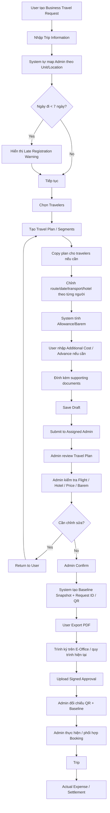
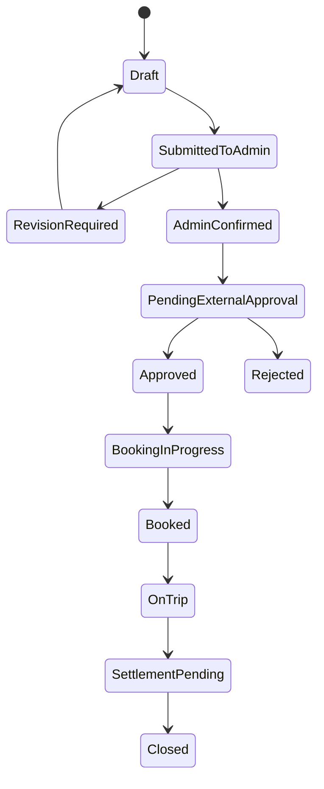

# Cập nhật tiến độ dự án Business Travel / Admin Expense Management

**Nguồn:** Transcript meeting 15/09/2026.

## 1. Tổng hợp 10 điểm chính cần tiếp tục phát triển

|#|Hạng mục|Kết luận / Requirement sau meeting|Trạng thái|
|---|---|---|---|
|1|**Tiến độ tổng thể**|Ứng dụng được đánh giá đã hoàn thiện khoảng **90%**, hiện chuyển từ giai đoạn build chức năng sang **end-to-end validation + UAT + chốt workflow** trước khi demo/bàn giao.|Gần hoàn tất|
|2|**Phân vùng Admin tự động**|User **không cần chọn Admin xử lý**. Hệ thống tự map theo Department/Unit/Location: HO → Admin HO; Đà Nẵng → Admin Đà Nẵng; Hà Nội → Admin Hà Nội; Nha Trang/Phú Yên → Admin vùng tương ứng. Admin vẫn cần khả năng override khi cần.|Confirmed requirement|
|3|**Cảnh báo đăng ký trễ**|Rule cần tính dựa trên **ngày hiện tại → ngày bắt đầu chuyến đi**. Threshold business đang được nhắc lại là **7 ngày**; UI hiện có dấu hiệu tính sai 6/7 ngày nên cần sửa calculation và message. Warning chỉ cảnh báo, **không block request**.|Cần fix|
|4|**Travel Plan đa người / đa chặng**|Một request có thể gồm nhiều traveler; mỗi traveler có nhiều travel segment. Có thể copy kế hoạch chung rồi chỉnh riêng từng người. Hỗ trợ trường hợp một số chặng tự túc và room-sharing khách sạn.|Core flow đã hình thành|
|5|**Chi phí & allowance**|Ăn uống, đi lại, khách sạn phải tính theo **barem/quy định + vùng + số ngày/đêm** và hiển thị làm mức tham khảo. User không cần nhập lại phần định mức. **Tiếp khách / Other Cost** linh hoạt hơn và có thể đưa vào Additional Advance.|Logic cần hoàn thiện/validate|
|6|**Advance không phải lúc nào cũng bắt buộc**|Với công tác nội địa 1–2 ngày, thực tế user thường tự chi trước và settlement sau; các chuyến dài hơn mới thường cần tạm ứng. Do đó Advance nên là **optional path**, không nên ép tất cả chuyến công tác phải qua cùng một flow tạm ứng.|Business rule quan trọng|
|7|**Nhiều tờ trình / supporting documents**|Một request có thể phải liên kết **nhiều tờ trình**, đặc biệt khi bổ sung traveler sau khi kế hoạch ban đầu đã tạo. UI cần hỗ trợ multi-upload/multi-select thay vì một document duy nhất.|Cần enhancement|
|8|**Chốt lại luồng Submit → Admin → Export**|Meeting nghiêng về flow: **User tạo request → Submit Admin → Admin review plan/giá → Confirm → User mới Export tờ trình để ký**. Không nên export final trước khi Admin kiểm tra giá vé, khách sạn, barem và các exception.|Quyết định flow chính|
|9|**Baseline + QR/Request Code**|Khi Admin đã confirm, hệ thống cần lưu một **baseline/snapshot** của request. File PDF export phải chứa Request ID/QR để Admin có thể đối chiếu file ký với dữ liệu hệ thống, tránh trường hợp user sửa file ngoài hệ thống mà không trace được. Đây là control point rất quan trọng.|Cần thiết kế/chốt|
|10|**Role, master data và rollout**|Cần phân biệt ít nhất: **System Admin**, **Admin/Travel Manager**, **User**. Đồng thời hoàn thiện master data Company/Department/Hotel/Location/Address, wording/icon dễ hiểu, manual và chạy một case thật end-to-end trước demo Anh Cẩn và rollout user.|UAT / rollout prep|

## 2. Điểm quan trọng nhất sau meeting

Luồng trước đây đang có rủi ro vì **Export → ký → Admin nhận file** nhưng Admin không có baseline để biết nội dung file có thực sự xuất từ hệ thống và có bị thay đổi hay không.

Meeting đã làm rõ rằng **Admin cần tham gia trước bước trình ký**, vì Admin là bên phải kiểm tra:

- Flight/hotel có phù hợp không.
    
- Giá tại thời điểm đó có vượt barem không.
    
- Có mùa cao điểm / biến động giá không.
    
- Có cần cộng exception/additional budget không.
    
- Travel Plan có khả thi không.
    

Chỉ sau khi Admin confirm mới nên coi dữ liệu là **Approved-for-Submission Baseline**.

Điều này làm vai trò ứng dụng rõ hơn:

> **Không chỉ là form tạo tờ trình, mà là hệ thống chuẩn hóa kế hoạch công tác + kiểm soát chi phí + tạo baseline trước khi đi vào quy trình ký duyệt chính thức.**

## 3. Target Process đề xuất cho quá trình đặt lịch công tác

Tôi đề xuất chốt V1 theo flow sau:



### Điểm thiết kế quan trọng

**Admin Confirm không đồng nghĩa với approval của lãnh đạo.**

Nó chỉ có nghĩa:

> Travel Admin đã kiểm tra kế hoạch, booking assumption và barem; dữ liệu này đủ điều kiện để tạo tờ trình chính thức.

Sau đó approval lãnh đạo vẫn thực hiện qua quy trình hiện hữu/E-Office.

Transcript cũng cho thấy tích hợp trực tiếp E-Office hiện chưa khả thi, nên V1 cần thiết kế **fallback upload signed document** thay vì để toàn bộ dự án bị block bởi integration.

## 4. State model nên áp dụng

Tôi khuyến nghị status đơn giản như sau:



Điểm cần tránh là dùng chung một status kiểu **Approved** cho cả Admin review và Management approval. Hai bước này hoàn toàn khác business meaning.

## 5. Logic chi phí nên chốt

|Cost Type|System|User|
|---|---|---|
|Meal / Allowance|Tính theo barem × days|Review|
|Hotel|Tính theo region/barem × nights|Review|
|Standard travel allowance|Tính theo rule|Review|
|Entertainment|Không cố định hoàn toàn|Nhập dự kiến|
|Other Cost|Không tự suy luận|Nhập|
|Additional Advance|Optional|User nhập khi cần|
|Actual Expense|Không dùng estimate thay thế|Nhập sau chuyến đi|

Một nguyên tắc quan trọng từ meeting: **Estimate/Entitlement ≠ Advance ≠ Actual Expense**. Ba con số này cần tách riêng để tránh user hiểu “hệ thống tính 5 triệu” nghĩa là “được ứng đúng 5 triệu”.

## 6. Baseline / QR control nên vận hành như sau

Khi Admin chọn **Confirm**:

```text
Request
TRV-2026-000123

Version
V3

Confirmed At
2026-09-21 15:42

Confirmed By
Admin HO

Baseline Total
18,650,000 VND
```

Hệ thống freeze snapshot của:

- Travelers
    
- Travel segments
    
- Dates
    
- Flight/hotel assumptions
    
- Allowance
    
- Additional costs
    
- Total estimated cost
    

PDF chứa:

```text
Request ID: TRV-2026-000123
Version: V3
QR Code: link tới baseline V3
```

Nếu user sửa dữ liệu sau Admin Confirm:

> Không overwrite baseline V3 → tạo **V4 / Revision Required**.

Như vậy Admin luôn có cơ sở audit và đối chiếu.

## 7. Role model đề xuất

|Role|Quyền chính|
|---|---|
|**System Admin**|System configuration, role/permission, global master data|
|**Travel Admin / Travel Manager**|Review requests, booking validation, master data thuộc nghiệp vụ, return/confirm request|
|**User**|Create/edit own request, submit, export khi được phép, upload signed document|
|**Approver**|V1 có thể vẫn approval ngoài hệ thống qua E-Office|

Tên **Travel Manager** hoặc **Travel Admin** nên dùng thay vì nhiều cấp cùng tên “Admin”, vì chính meeting cũng cho thấy cách gọi “admin của admin” gây khó hiểu.

## 8. Những gap cần đóng trước UAT

Các gap quan trọng hiện tại:

- Fix **7-day warning calculation**.
    
- Complete Department/Location → Admin mapping.
    
- Hotel master cần **Address/Location**.
    
- Multi-document attachment.
    
- Save trước Export.
    
- Chỉ enable Export sau **Admin Confirm**.
    
- Baseline snapshot + Request ID/QR.
    
- Confirm permission của Admin/Manager.
    
- Review wording menu/master data.
    
- Review icons hiện đang gây khó hiểu cho user.
    
- Test full flow bằng **case công tác thật**, không chỉ dummy data.
    

## 9. Kế hoạch rollout từ transcript

Theo nội dung meeting:

1. IT hoàn thiện các chỉnh sửa còn lại.
    
2. Admin business user sử dụng thử bằng case thực.
    
3. Cùng chạy **end-to-end case** và lấy case đó làm demo.
    
4. Demo/validation với **Anh Cẩn**.
    
5. Nhận feedback và chỉnh tiếp.
    
6. Demo/release rộng hơn với management và representative users như chị Bình.
    
7. Sau khi flow ổn định mới **freeze V1 + handover**.
    

Transcript đề cập hướng làm việc **Thứ Hai → review/UAT, Thứ Tư → Anh Cẩn, Thứ Sáu → buổi release/demo lớn hơn**. Tuy nhiên transcript có điểm không nhất quán về ngày họp (“hôm nay 16”) trong khi tài liệu được xác định là meeting 15/09, nên các ngày dưới đây tôi coi là **target tentative** cần calendar-confirm.

## 10. Đánh giá tiến độ hiện tại

**Current phase:** `Feature Complete → Business Validation / UAT`

**Ước lượng theo meeting:** khoảng **90% functional completion**, nhưng phần 10% còn lại là phần quan trọng nhất để production-ready:

> workflow governance, exception handling, baseline/traceability, role permission và actual-user usability.

Tức là không nên xem dự án chỉ còn “10% coding”. Phần còn lại quyết định ứng dụng có thực sự thay được quy trình Excel/email/manual hiện tại hay không.

# Action Items

|#|Action Item|Owner đề xuất / theo meeting|Priority|Target|
|---|---|---|---|---|
|1|Hoàn thiện mapping **Department/Unit/Location → Assigned Admin**|Admin team cung cấp mapping; IT config|P0|Trước UAT|
|2|Fix rule **Late Registration < 7 days** và calculation theo system date|IT/Dev|P0|Trước UAT|
|3|Hoàn thiện multi-traveler / multi-segment + copy/edit riêng từng traveler|IT/Dev|P0|Trước demo|
|4|Validate allowance theo region, days/nights và tách Estimate / Advance / Actual|IT + Admin|P0|Trước demo|
|5|Bổ sung **Other Cost / Entertainment / Additional Advance** đúng rule|IT/Dev|P1|Trước UAT|
|6|Cho phép attach **nhiều tờ trình / supporting documents**|IT/Dev|P1|V1 nếu kịp|
|7|Chốt flow **Submit Admin → Admin Confirm → Export PDF**|BA + Admin + IT|P0|Ngay|
|8|Implement **Baseline Snapshot + Request ID/QR** trước Export|IT/Dev|P0|Trước go-live|
|9|Bổ sung Hotel **Address/Location** và rà master data Company/Department/Hotel|Admin + IT|P1|Trước UAT|
|10|Rà lại role: System Admin / Travel Manager / User và permission create/edit/reopen|BA + IT + Admin|P0|Trước UAT|
|11|Hoàn thiện User Manual ngắn và wording/icon UI|Uyên/IT theo meeting|P1|Trước rollout|
|12|Tạo **1 real business case end-to-end** để test và dùng cho demo|Admin + Nguyên/IT|P0|Thứ Hai dự kiến 21/09|
|13|Review/demo flow với **Anh Cẩn**|Project team|P0|Thứ Tư dự kiến 23/09|
|14|Consolidate feedback và fix remaining gaps|IT/BA|P0|23–25/09|
|15|Demo/release wider user group / management, có thể gồm chị Bình|Project + Admin|P0|Thứ Sáu dự kiến 25/09|

### Open Questions cần chốt

- Admin Confirm xong, **ai chịu trách nhiệm upload signed tờ trình**: User hay Admin? Transcript cho thấy cả hai khả năng đang được cân nhắc.
    
- Khi user sửa request sau Admin Confirm: cho sửa trực tiếp hay bắt buộc **Reopen / New Version**?
    
- Booking flight/hotel chỉ được **quản lý trạng thái** trong ứng dụng hay V1 có thao tác booking thực tế?
    
- Rule “7 ngày” cần xác nhận cách tính: `Departure Date - Current Date < 7` hay tính inclusive ngày hiện tại.
    
- E-Office V1 xác định chính thức là **external/manual integration fallback** hay vẫn giữ API integration trong backlog.